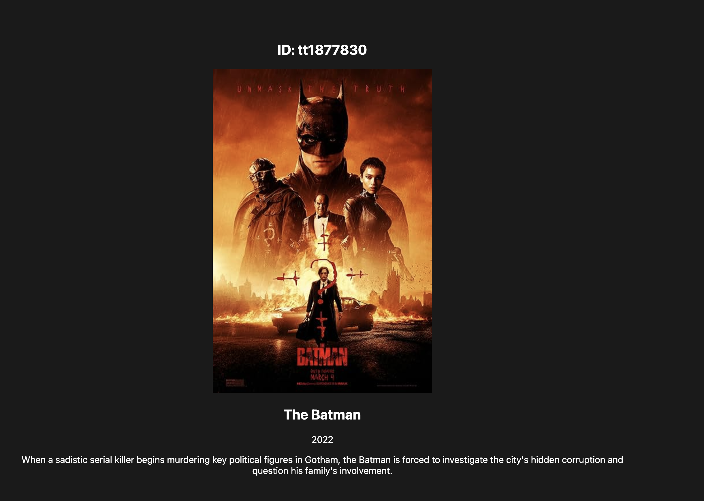
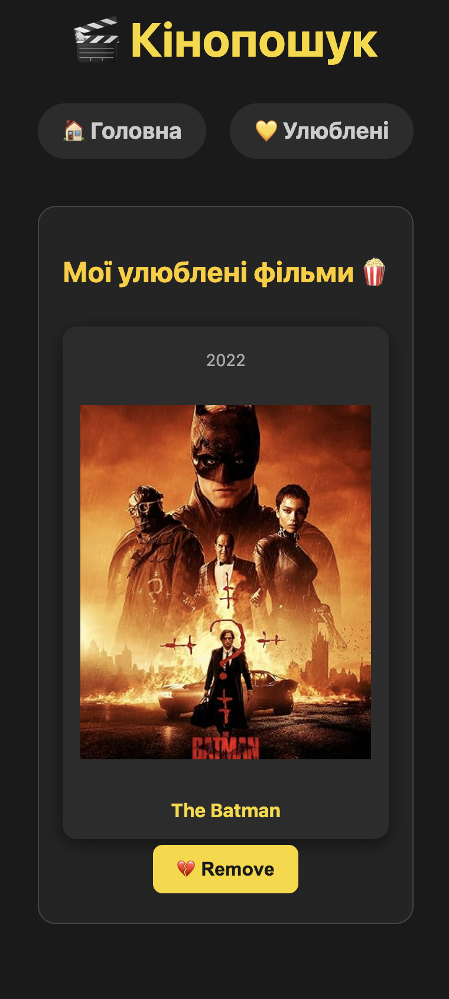

# 🎬 Movie Sync & Discovery Tool

Професійний інструмент для автоматизованої синхронізації кіноданих, побудований на базі Node.js. Система забезпечує безшовний імпорт даних із зовнішніх API у локальне сховище з можливістю подальшого керування та фільтрації через веб-інтерфейс.

---

## 🖼 Screenshots

### Головна сторінка

### Сторінка результату пошуку

### Сторінка фаворитів

### Сторінка деталей

---

## 🚀 Основний функціонал

* **API Synchronization:** Автоматичне отримання актуальних даних про фільми через інтеграцію з зовнішніми REST API.
* **Structured Storage:** Трансформація "сирих" JSON-відповідей у структуровану реляційну базу даних SQLite.
* **Advanced Filtering:** Система фільтрації на клієнтській та серверній сторонах для швидкого пошуку потрібного контенту.
* **Web Dashboard:** Лаконічний та інтуїтивно зрозумілий UI для візуалізації синхронізованої бібліотеки.

---

## 🛠 Технічний стек

| Технологія | Використання |
| :--- | :--- |
| **React** | Побудова користувацького інтерфейсу та компонентна архітектура |
| **TypeScript** | Статична типізація для надійнішого коду та автодоповнення |
| **Fetch API / Axios** | Асинхронні запити до стороннього кіно-API (REST) |
| **HTML5 / CSS3** | Верстка, стилізація та адаптивний дизайн |

---

## 🏗 Архітектура застосунку

Проєкт побудований за класичною фронтенд-архітектурою з акцентом на роботу зі станом:
1.  **API Integration Layer:** Відповідає за комунікацію із зовнішнім сервісом (отримання списків фільмів, пошук, деталі).
2.  **State Management:** Управління даними всередині React за допомогою хуків (збереження завантажених фільмів, обробка стану завантаження та помилок).
3.  **UI Components:** Модульні React-компоненти (картки фільмів, панель пошуку, сітка результатів), які рендерять отримані дані для користувача.

